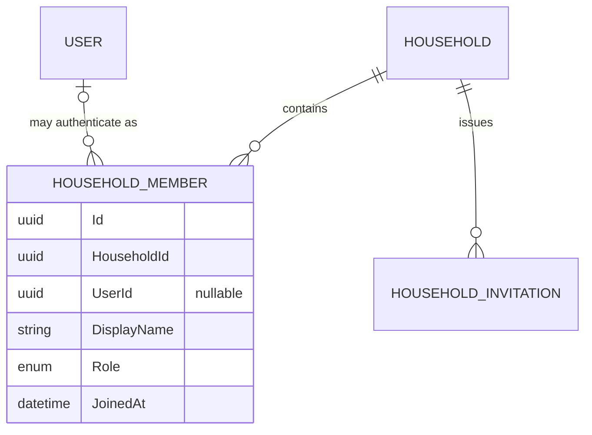
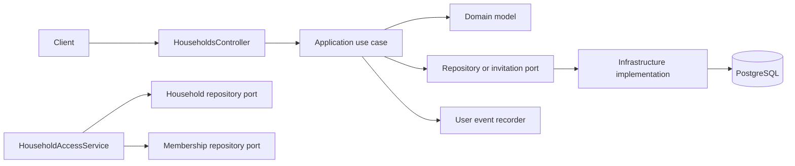
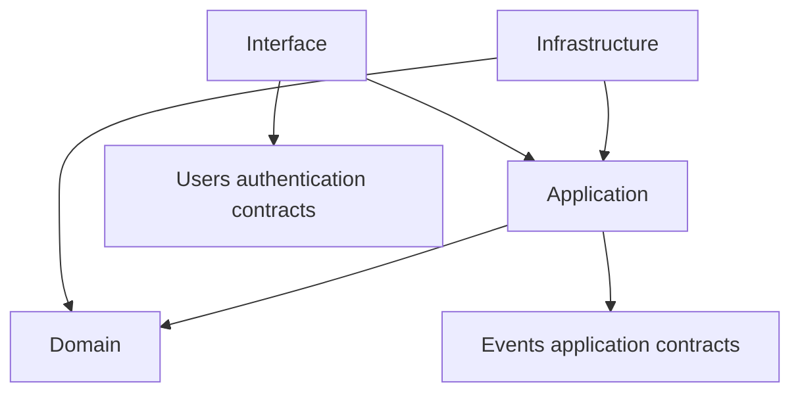

# Households

The Households feature owns household identity, subscriptions, membership, and
invitations. A household member is distinct from an authenticated user:
`HouseholdMember.UserId` is optional, allowing a household to represent children,
teenagers, or other members who do not have an account. Linking a member to a user
grants that user authenticated access to the household.

## Structure

```text
Households/
  Application/
    Households/         Household use cases, contracts, access service, and ports
    Members/            Membership and invitation use cases, contracts, and ports
  Domain/
    Households/         Household and subscription models
    Members/            HouseholdMember, HouseholdInvitation, roles, and statuses
  Infrastructure/
    Households/         EF entity, configuration, and repository
    Members/            EF entities, configurations, repository, and invitation sender
  Interface/            Household controller and HTTP request contracts
```

Use cases stay at the top of their application group. `Ports/` contains
persistence and integration abstractions, while `Contracts/` contains application
output models. The household commands and queries currently live beside their use
cases.

## Domain model



`HouseholdMember` is the household identity. `DisplayName` is the required,
household-local name shown by the application. `UserId` is only an optional link to
an authentication identity; it is not the member's identity. Removing a user sets
this link to null rather than deleting the household member. Linked user IDs are
unique within a household, while any number of unlinked members may exist.

Roles are `Owner`, `Admin`, and `Member`. A household also records its owning user
on `Household.OwnerId`. Creating a household creates a linked owner membership in
the same operation.

## Request flow



`HouseholdAccessService` grants access when the authenticated user owns the
household or has a linked membership. Unlinked members do not authenticate and
therefore do not grant API access by themselves. Unauthorized household lookups
are exposed as not found.

## HTTP API

All routes are authenticated and prefixed with `/api/v1`.

### Households

| Method   | Route                       | Use case                 | Result                                   |
|----------|-----------------------------|--------------------------|------------------------------------------|
| `GET`    | `/households`               | `GetHouseholdsUseCase`   | Households accessible to the user        |
| `GET`    | `/households/{householdId}` | `GetHouseholdUseCase`    | One accessible household                 |
| `POST`   | `/households`               | `CreateHouseholdUseCase` | Creates a household and owner membership |
| `PUT`    | `/households/{householdId}` | `UpdateHouseholdUseCase` | Renames an owned household               |
| `DELETE` | `/households/{householdId}` | `DeleteHouseholdUseCase` | Deletes an owned household               |

Create and update requests contain a `name` property. Household names are
required and limited to 100 characters.

### Members and invitations

| Method | Route                                          | Use case                           | Result                                            |
|--------|------------------------------------------------|------------------------------------|---------------------------------------------------|
| `GET`  | `/households/{householdId}/members`            | `GetHouseholdMembersUseCase`       | Members of an accessible household                |
| `POST` | `/households/{householdId}/members`            | `CreateHouseholdMemberUseCase`     | Creates an accountless member                     |
| `PUT`  | `/households/{householdId}/members/{memberId}` | `UpdateHouseholdMemberUseCase`     | Updates a member                                  |
| `GET`  | `/households/{householdId}/invitations`        | `GetHouseholdInvitationsUseCase`   | Pending invitations                               |
| `POST` | `/households/{householdId}/invitations`        | `InviteHouseholdMemberUseCase`     | Creates or resends an invitation                  |
| `POST` | `/households/invitations/{token}/accept`       | `AcceptHouseholdInvitationUseCase` | Accepts an invitation and creates a linked member |

Only the household owner may issue invitations. Invitation email addresses are
normalized, invitations expire after seven days, and invitations cannot grant the
owner role.

Only the household owner may create accountless members. Linking an existing
unlinked member to a user account is not yet implemented.

## Dependencies



Other features consume household authorization through
`IHouseholdAccessService`. They should not query household infrastructure or
reimplement membership checks.

## Persistence note

The pending database migration must add required `display_name` columns to
`household_members` and `household_invitations`, make
`household_members.user_id` nullable, and change the user foreign key's delete
behavior to set null. Migration files are owned by the project owner and must not
be generated as part of ordinary feature work unless explicitly requested.

## Tests

Tests mirror the production feature under:

```text
tests/Domu.Tests/Features/Households/
```

Application tests cover household, membership, and invitation use cases. Domain
tests cover household subscription behavior and membership invariants.
