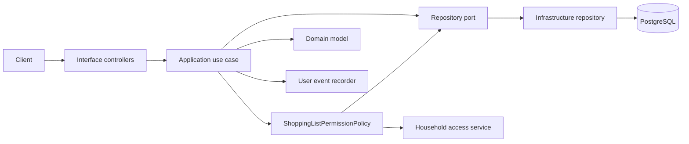
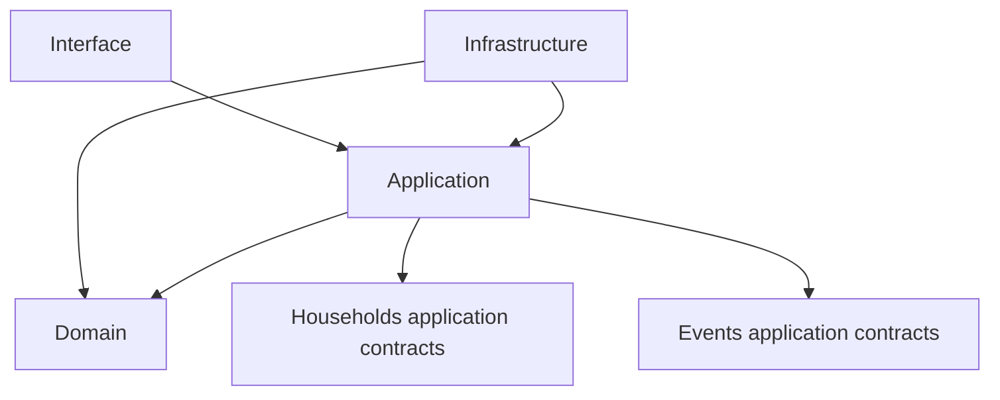

# Shopping Lists

The Shopping Lists feature lets members of a household manage named shopping
lists and the items within them. Lists are household-shared resources;
`CreatedByMemberId` records who created a list but does not make it private to that
member.

## Structure

```text
ShoppingLists/
  Application/
    ShoppingLists/       List use cases, commands, queries, contracts, and ports
    Items/               Item use cases, commands, queries, contracts, and ports
  Domain/
    ShoppingLists/       ShoppingList domain model
    Items/               ShoppingListItem domain model and text rules
  Infrastructure/
    ShoppingLists/       EF entity, configuration, and repository
    Items/               EF entity, configuration, and repository
  Interface/
    ShoppingLists/       List controller and HTTP request contracts
    Items/               Item controller and HTTP request contracts
```

Use cases stay at the top of their application group. Their input records are
separated into `Commands/` for state changes and `Queries/` for reads. `Ports/`
contains persistence abstractions, while `Contracts/` contains application
output models.

## Request flow



The permission policy verifies household membership and ensures that a list or
item belongs to the household and route-scoped list. Archived lists are treated
as not found.

## HTTP API

All routes are authenticated and prefixed with `/api/v1`.

### Lists

| Method   | Route                                                       | Use case                    | Result                         |
|----------|-------------------------------------------------------------|-----------------------------|--------------------------------|
| `GET`    | `/households/{householdId}/shopping-lists`                  | `GetShoppingListsUseCase`   | Active lists for the household |
| `GET`    | `/households/{householdId}/shopping-lists/{shoppingListId}` | `GetShoppingListUseCase`    | One active list                |
| `POST`   | `/households/{householdId}/shopping-lists`                  | `CreateShoppingListUseCase` | Creates a named list           |
| `PUT`    | `/households/{householdId}/shopping-lists/{shoppingListId}` | `UpdateShoppingListUseCase` | Renames a list                 |
| `DELETE` | `/households/{householdId}/shopping-lists/{shoppingListId}` | `DeleteShoppingListUseCase` | Archives a list                |

Create and update requests contain a `name` property. Deleting a list is a soft
delete: `ArchivedAt` is set and subsequent access returns not found.

### Items

The item route base is:

```text
/households/{householdId}/shopping-lists/{shoppingListId}/items
```

| Method   | Relative route      | Use case                                 | Result                    |
|----------|---------------------|------------------------------------------|---------------------------|
| `GET`    | `/`                 | `GetShoppingListItemsUseCase`            | Items in the list         |
| `POST`   | `/`                 | `CreateShoppingListItemUseCase`          | Creates an item           |
| `PATCH`  | `/{itemId}`         | `UpdateShoppingListItemUseCase`          | Updates an item           |
| `POST`   | `/{itemId}/check`   | `SetShoppingListItemCheckedStateUseCase` | Marks an item checked     |
| `POST`   | `/{itemId}/uncheck` | `SetShoppingListItemCheckedStateUseCase` | Marks an item unchecked   |
| `DELETE` | `/{itemId}`         | `DeleteShoppingListItemUseCase`          | Deletes an item           |
| `DELETE` | `/checked`          | `ClearCheckedShoppingListItemsUseCase`   | Deletes all checked items |

Items may optionally reference a Space or inventory Item. The permission policy
rejects references that do not belong to the same household.

## Dependencies



The feature does not depend on another feature's infrastructure or interface.
Household authorization and event recording are consumed through application
contracts.

## Persistence note

The domain and API no longer have a default-list concept. The EF entity still
maps the legacy `is_default` column and writes `false` so the application remains
compatible with the current database schema. The project owner can remove that
column and its indexes in a future migration.

Do not generate that migration as part of ordinary feature work unless the
project owner explicitly requests it.

## Tests

Tests mirror the production feature under:

```text
tests/Domu.Tests/Features/ShoppingLists/
```

Application tests cover list and item use-case behavior. Domain tests cover
shopping-list item rules and invariants.
